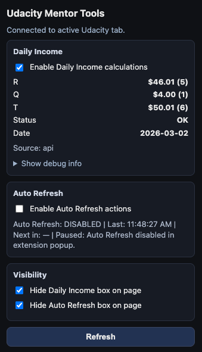

# Udacity Mentor Dashboard Tools (Brave/Chrome Extension)

This extension combines both scripts into one package and adds a popup UI:

- Daily income counter (`daily-income.js`)
- Queue auto-refresh (`auto-refresh.js`)
- Bridge/messaging layer (`bridge.js`)
- Popup (`popup.html`, `popup.js`, `popup.css`)

## Included behavior

- Daily Income Counter runs on: `https://mentor-dashboard.udacity.com/queue/*`
- Auto Refresh runs on: `https://mentor-dashboard.udacity.com/*`

## Popup demo

## Install in Brave (or Chrome)

1. Open `brave://extensions` (or `chrome://extensions`).
2. Enable **Developer mode**.
3. Click **Load unpacked**.
4. Select this folder:
   - `/Users/spiros/udacity-mentor-dashboard-extension`

## Notes

- `daily-income.js` is loaded at `document_start` so API discovery hooks are installed early.
- `daily-income.js` and `auto-refresh.js` run in the page's main world to preserve Tampermonkey-like behavior.
- `bridge.js` runs as a normal extension content script for `chrome.runtime` messaging and `chrome.storage` support.
- Click the extension icon to open a popup that:
  - Shows live Daily Income values (R/Q/T/status/date/details) from the page
  - Keeps full Daily Income debug text behind a collapsed "Show debug info" section
  - Lets you enable/disable Daily Income calculations
  - Shows Auto Refresh status text
  - Lets you enable/disable Auto Refresh actions without uninstalling the extension
  - Lets you hide/show the Daily Income and Auto Refresh boxes on the page
- Visibility preferences are saved in extension storage and applied on reload.
- Low-load defaults: Daily Income starts disabled; Auto Refresh starts enabled.
- Auto Refresh countdown resets when you manually reload the page.
- Daily Income parsing now handles rows with multiple dollar amounts (for example payout + bonus) more accurately.
- History parsing now reads semantic grid rows (`role=row`) with fallback logic, reducing missed entries when row action labels vary.
- Discovery now avoids `certifications` false positives and can fall back to stronger API totals when History appears truncated.
- API pagination now boosts page size (`per_page`) to reduce first-page-only undercount scenarios.
- Daily total fallback now merges multiple discovered API seeds (including weak candidates) with cross-source dedupe for better completeness.
